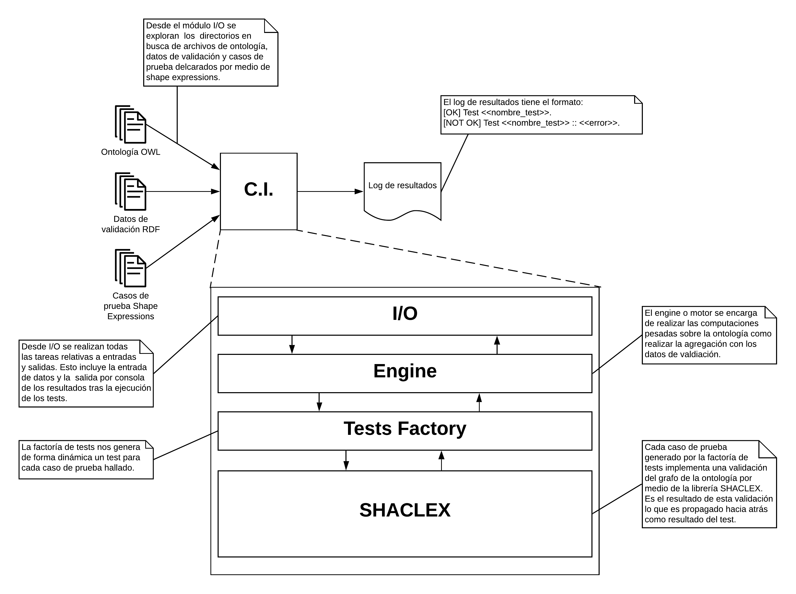

# Sistema de Integración continua para desarrollo de ontologías con control de versiones.

El sistema de integración continua para el desarrollo de ontologías en un sistema de control de versiones permite que para cada cambio (commit) que se realiza sobre la ontología se realicen una serie de tests (test suite) durante los cuales lo que se comprueba es que los cambios introducidos no interfieren con las restricciones definidas en los datos de validación.

## Introducción

Para poder llevar a cabo esta tarea necesitamos tres elementos que serán la entrada de nuestro sistema.

1. La ontología en formato OWL. Puede estar compuesta por uno o por múltiples ficheros.
2. Los datos de validación. Se compone de instancias RDF que han sido certificadas como la fuente de verdad para las restricciones que tiene que cumplir la ontología. Están definidos como recursos RDF.
3. Los casos de prueba que queremos lanzar contra la ontología. En este caso se implementan por medio de shape expressions. Cada caso de prueba se declara en un fichero separado y define una restricción que tiene que cumplir la ontología. De esta forma existirá un output directamente relacionado con cada archivo de shape expressions.

A contiunuación se muestra un esquema gerneral de la arquitectura externa e interna del sistema.



## Datos de entrada

Como se comenta en la introducción los datos de entrada son los ficheros OWL que contienen la ontología, los datos de validación en RDF y los casos de pruebas en formato de shape expressions.

Estos datos se encuentran en directorios diferentes, la ontología se encuentra en `/ontology`, los datos de validación en `/data` y los casos de prueba en `/test`. Una vez tenemos esa estructura de directorios hecha encontramos en el directorio `/ci` el código fuente necesario para realizar la integración continua. Más adelante se hablará sobre ese códifo fuente.

Como se ve en la arquitectura el módulo de I/O es el encargado de encontrar todos estos directorios, para ello su algoritmo de funcionamiento es el siguiente:

```java
o = directorio ontología
d = directorio datos
t = directorio tests

oa = obtenArchivosConExtensionDedirectorio(o, ".owl")
da = obtenArchivosConExtensionDedirectorio(d, ".rdf")
ta = obtenArchivosConExtensionDedirectorio(t, ".shex")
```

De esta forma en oa, da, ta tenemos los archivos correspondientes a la ontología, los datos y los tests. Estos datos son inmediatamente enviados al engine para que empiece a procesarlos.

## Motor de integración continua

El motor de integración continua entra en acción en el momento en el que recibe los archivos de la interfaz de entrada / salida.

## Recepción de los datos.

Nada más recibidos los datos en oa, da y ta se empieza por realizar una agregación de los archivos de la ontología para construir en memeoria un grafo representativo. Este grafo será llamado O. La agregación de la ontología se realiza de la siguiente forma.

```java

G = fold oa_1 over oa_i till oa_n

```
Para saber más sobre la función matemática fold reocmendamos este [enlace](https://www.modernescpp.com/index.php/fold-expressions).

## Invocación de tests dinámicos

Una vez tenemos la ontología agregada sobre `G` tenemos que crear un caso de prueba para cada uno de los ficheros hallados en el directorio de `/tests`. Se realiza a través del siguiente algoritmo.

```java
para cada archivoTest::ta_i en ta:
  Factoria de tests -> genera nuevo test para el conjunto (G, da_i, ta_i)
```

A partir de este punto se delega el trabajo a la factoría de tests.

# Creación dinámica de tests

Cada vez que desde el motor de integración continua se invoca a la factoría de tests esta genera un test dinámico de java/sacala que se agrega a una test suite de forma que es imprescindible que todos y cada uno de ellos terminen satisfactoriamente para que cualquier sistema de integración continua como travis / jenkins marquen el cambio como correcto.

Cada uno de los tests creados invocan a la librería de SHACLEX de la siguiente forma:

```java
createTests(test):
  SHACLEX -> validator -> valida el conjunto formado por (G, da_i, ta_i)
```

Donde recordamos que G es `fold oa_1 over oa_i till oa_n`.

# Salida de datos: resultados

La idea general del sistema de integración continua es que ayude en el desarrollo de ontologías y por tanto los mensajes de error que se generen han de ser lo suficientemente descriptivos como para que los usuarios entiendan donde han cometido el fallo.

De esta forma el formato de salida tras la ejecución de la validación es:

```java
[OK]      Test IntegridadReferencialDoctorado.
[OK]      Test HerenciaClaseProfesor.
[NOT OK]  Test HetenciaGrupoInvestigación. :: Nodo Labra no cumple restricción de tener propiedad NOMBRE (P09823475).
```
